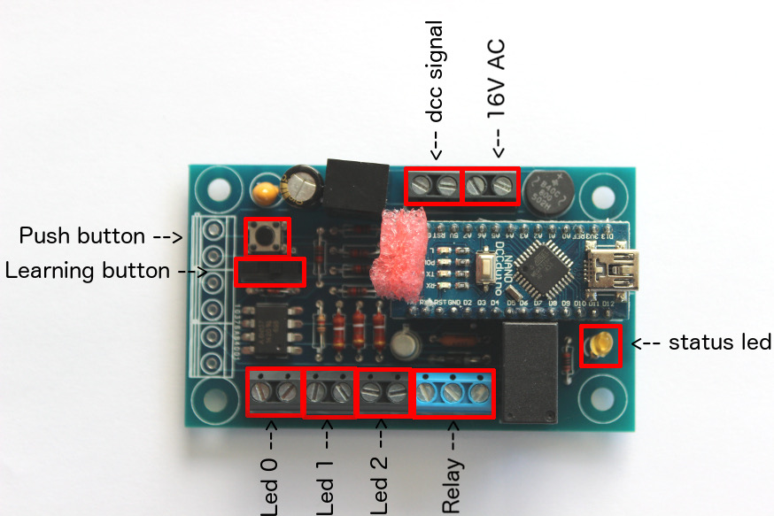
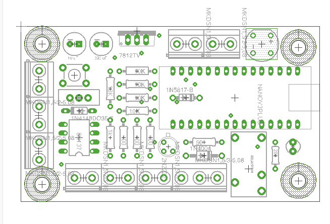

Un decodeur d'accessoire DCC versatile basé sur Arduino
=======================================================

Quand j'ai commencé à construire mon réseau à l'échelle N, j'ai regardé pour piloter des lumières (SMD 0402, ou des led standards), mais j'avais soit de la difficulté à les programmer simplement (CV & co), ou je suis tombé sur des décodeurs à fabriquer soi-meme que je n'ai pas réussi à faire fonctionner. Du coup j'ai décidé de construire le mien en partant d'un Arduino nano, qui soit facile à reprogrammer.

Ce décodeur est assez simple. On peut
 * lui assigner une adresse DCC (via un bouton d'apprentissage)
 * le connecter à des lampes LED ou utiliser comme relai
 * pour les lampes LED, on peut choisir différents modes, via un bouton poussoir. On peut avoir une lumière constante, une lumière qui grésille, ou avoir les 3 sorties en mode chenillard pour représenter par exemple des feux de travaux.

Ce décodeur a été concu pour etre alimenté par du 16V alternatif, mais on peut aussi l'alimenter via le DCC directement (15v ou 18v) ou via un un signal 16V continu

L'utiliser
==========

L'alimenter
-----------
Ce decodeur a été concu pour etre alimenté par une source 16V alternatif. Il est possible de l'alimenter directement par le signal DCC, mais le circuit n'est pas le le plus efficace en terme de consommation électrique (on alimente un Arduino, des lampes, et éventuellement un relai. Ca fait beaucoup), et dans la plupart des cas, on voudra surement éviter de bouffer tout le courant du signal DCC au détriment des locomotives...

C'est pour cela qu'il y a 2 jeux de cables:
 * un pour l'alimentation 16V alternatif
 * un pour le signal DCC

Assigner une adresse DCC
------------------------

Pour assigner une adresse DCC, il suffit de mettre le bouton d'apprentissage à l'opposé de l'arduino.
Dans cette position, chaque fois que le décodeur voit une commande passer, il va stocker l'adresse utilisée comme étant son adresse (et va le confirmer en faisant clignoter sa led de status).
Donc pour assiger une adresse dcc il suffit de :
 * pousser le bouton d'apprentissage à l'opposé de l'arduino 
 * envoyé une commande DCC avec l'adresse souhaitée 
 * la led de statut va clignoter pour signifier qu'elle a bien vu et appris l'adresse 
 * remettre le bouton d'apprentissage vers l'arduino 

Connecter des LED
-----------------

Dans le bas de la carte, il y a 3 slots pour leds. Le + est a gauche. Des resistances sont déjà prévues pour éviter de claquer les leds. Normalement vous connecter une led par slot seulement (du au fait que chaque led a une tension nominale qui varie d'une led a une autre)

Ensuite, si vous utilisez le bouton poussoir, vous allez boucler entre 3 modes:
 * lumière constante (que ce soit alumé ou eteint)
 * grésillement/vacillement aléatoire (pour faire vieux néon d'entrepot)
 * feux de travaux sous forme de chenillard à 3 canaux (la première lampe va s'allumer, puis ca va etre la 2eme, puis la 3eme, puis de nouveau la 1ere)

Il y a juste à appuyer sur le bouton poussoir pour boucler entre les 3 modes. La led de statut va vous dire dans quel mode vous etes.

Connecter au relay
------------------

Juste a coté des slots pour LED, il y a un slot avec 3 IO. Il s'agit du relai. Les 3 IO sont: sortie A, entree, sortie B
Donc l'IO du milieu etre votre entrée (quelque soit le type "d'entrée" que vous avez), et le relai va connecter cette entrée soit sur l'IO de gauche, soit l'IO de droite.

Connecter les autres IO
=======================

En plus des led et du relai il y a des IO generiques, qui mettent à disposition:
 * le 5v et la masse de l'arduino
 * les sorties analogiques 6 et 7 de l'arduino
 *  etles sorties numériques 6 et 7 de l'arduino

Vous pouvez les utiliser à votre avantage, mais il faudra faire un peu de programmation: je n'ai rien codé pour sortir un quelconque signal par ces sorties, dans le programme fourni par défaut

Assember
========

Si vous voulez un décodeur tout fait, vous pouvez me contacter et je peux en fournir un: nicolas.zin@gmail.com

Dans le cas contraire, vous pouvez l'assemblez vous meme. vous aurez juste besoin du circuit imprimé, et bien entendu des composants.
Les fichiers gerber pour le cicruit imprimé sont disponible ici: [arduinov1.3.zip](arduinov1.3.zip) (pour le code source eagle, voir plus bas)

Pour l'assemblage complet, voici le "Bill Of Material":

Composant               |nombre   |ref
------------------------|---------|------------------------------------
arduino nano            |1        |aliexpress
bridge rectifier        |1        |mouser 625-B40C800G-E4
capa 330uF              |1        |mouser 667-EEU-FM1C331
capa 10uF               |1        |mouser 581-TAP106K025SCS
DC-DC converter (9VDC)  |1        |mouser 490-V7809-1000 (ou moins cher: voltage regulator mouser 511-L7809CV mais il est recommandé d'acheter un radiateur)
R 50 ohm                |1        |mouser 71-CPF150R000FEE14
relay                   |1        |sparkfun COM-00100
diode 4004              |1        |mouser 512-1N4004
transistor 2n2222       |1        |mouser 610-2N2222
R 10k ohm               |5        |mouser 71-CCF50-10K
R 1k ohm                |1        |mouser 603-CFR-12JR-521K
diode 4148              |1        |mouser 512-1N4148
toggle button           |1        |sparkfun COM-00102 (maybe mouser 633-SS12SDP2)
push button             |1        |SPARKUN COM-00097 (ou mouser 693-1301.9308)
led                     |1        |mouser 941-C4SMFRJSCT0W0BB2 (or mouser 630-HLMP-1301)
R 400 ohm               |3        |mouser 660-MF1/2LCT52R391J
terminal block  2 pos   |8        |mouser 845-30.702 (ou mouser 651-1729128)
terminal block 3 pos    |1        |mouser 845-30.703 (ou mouser 651-1729131)
headers                 |2        |mouser 855-M20-7821546
high speed optocoupler  |1        |mouser 630-6N137-000E
R 200 ohm               |1        |mouser 71-CCF50-200
diode shottky           |1        |mouser 833-SR108-TP

Le reprogrammer
===============

Si vous etes familier avec la programmation d'un Arduino, vous pouvez le reprogrammer pour faire ce que bon vous semble. Et c'est toute la beauté de la chose! Voici les sources que j'utilise: [dccduino.ino](arduinoSource/dccduino/dccduino.ino)

C'est basé sur la librairie dc de Minabay, Et donc vous allez devoir installer: https://github.com/MynaBay/DCC_Decoder

L'etendre
=========

Si vous souhaitez developper votre propre decodeur dcc, je fournis aussi les sources Eagle: [arduinoDcc1.3.sch](arduinoDcc1.3.sch) et [arduinoDcc1.3.brd](arduinoDcc1.3.brd)

Adaptez comme bon vous semble ces sources, pour coller à vos besoins. Mais je les fournis "as is", je peux repondre à quelques questions, mais si vous commencez à changer le layout, vous devez normalement savoir ce que vous faites, je ne pourrais surement pas vous aider à debugger si ca ne marche pas.

Licence
=======
Le code arduino et les schemas Eagle sont sous licence [GPL v2](gpl-2.0.txt)
