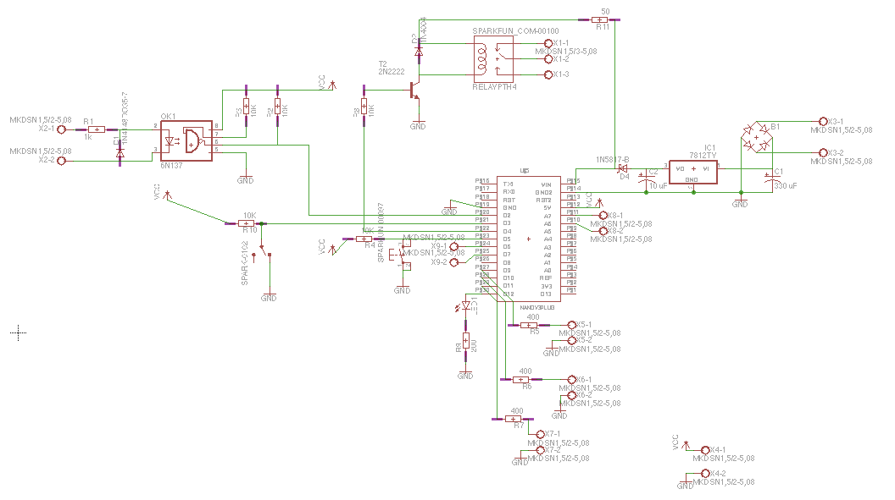

A versatile Arduino stationary dcc decoder
==========================================

When constructing my dcc based train model, I looked for dcc decoder to pilot light (SMD 0402, or standard led), but had difficulty to program them for custom scenario (blinking, road works style, …). There are also some DIY dcc decoder (opendcc decoder) but didn’t manage to make them working. So I decided to create my own stationary dcc decoder based on Arduino (nano), to be able to reprogram it at wish.

This decoder is pretty simple, you can
 * assign it a dcc address (via a learning switch button)
 * connect LED lights, or a relay
 * choose the light mode if you connected lights. There are 3 different modes you can choose via a push button: constant light (on or off), flicker mode, or 3 way road work lights mode

It has been designed to be powered by a 16V AC, but can be as well be powered via DCC signal (15v or 18v), or a DC signal.

Using it
========

Powering
--------
This decoder is designed to be powered by a 16V AC power source. It is possible to power it with the dcc signal, but my circuit is not the most power efficient stationary decoder (due to the fact that it power lights, an arduino and eventually a relay), so you don’t want that, except in rare situation.

This is why there are 2 set of cables:
 * one for the 16V AC
 * one for the DCC signal

Assign a dcc address
--------------------

To assign a dcc address, you have to use the learning switch opposite to the Arduino.
In that position, each time it see a stationary decoder command coming on, it will store it as its new address (and will acknowledge that by blinking the status led).
So to assign a dcc address you just have to
 * push the learning switch opposite to the Arduino.
 * send a command with the wished address
 * you will see the status led blinking, stating that it saw the address and learned it
 * push back the learning switch towards the Arduino

Connect light
-------------

On the bottom of the card, you have 3 slots for leds. The + of the led must be on the left. Normaly you can connect only one led per slot (due to the nominal tension that each led has, 2 different led don't have the exact same nominal tension).

If you use the push button, you will circle between 3 modes:
 * constantly on (or off)
 * flickering seldomly
 * 3 way road work lights (it will switch on the first light, then the second light, then the 3rd light, and cycle again to the first light)

You just has to use the push button to cycle between the 3 modes. The little status led, will tell you in which mode you are.

Connect relay
-------------

Close to the lights there is a block of 3 pins for the relay (if you decide to build it), which are in this order: low ouput, input, high output.
So the one on the middle is your input (whatever your input is), and the relay will connect it either to the left pin or to the right pin.

Connect to the other IO
=======================

There are some generic IO available, that expose
 * 5v and ground
 * analog pins 6 and 7
 * and digital pins 6 and 7

You can use them at your own advantage, but you will need to reprogram the Arduino to you own purpose: I didn’t program anything on them.

Assemble it
===========

If you don’t want to assemble, or just want the PCB already fabricated, contact me, and I can provide it for you: nicolas.zin@gmail.com

If you prefer to fully assemble it, you will need to get the PCB, and of course the components.
The PCB gerber files are here: https://github.com/nzin/arduinodcc/blob/master/arduinov1.2.zip (for the eagle source check below)

To fully assemble it, the full Bill Of Material is:

item                    |how many |ref
------------------------|---------|------------------------------------
arduino nano            |1        |aliexpress
bridge rectifier        |1        |mouser 625-B40C800G-E4
capa 330uF              |1        |mouser 667-EEU-FM1C331
capa 10uF               |1        |mouser 581-TAP106K025SCS
voltage regulator 7807TV|1        |mouser 511-L7809CV
R 50 ohm                |1        |mouser 71-CPF150R000FEE14
relay                   |1        |sparkfun COM-00100
diode 4004              |1        |mouser 512-1N4004
transistor 2n2222       |1        |mouser 610-2N2222
R 10k ohm               |5        |mouser 71-CCF50-10K
R 1k ohm                |1        |mouser 603-CFR-12JR-521K
diode 4148              |1        |mouser 512-1N4148
toggle button           |1        |sparkfun COM-00102
push button             |1        |SPARKUN COM-00097
led                     |1        |mouser 941-C4SMFRJSCT0W0BB2
R 400 ohm               |3        |mouser 660-MF1/2LCT52R391J
terminal block  2 pos   |8        |mouser 845-30.702 (or mouser 651-1729128)
terminal block 3 pos    |1        |mouser 845-30.703 (or mouser 651-1729131)
headers                 |2        |mouser 855-M20-7821546
high speed optocoupler  |1        |mouser 630-6N137
R 200 ohm               |1        |mouser 71-CCF50-200

Reprogram it
============

If you are familiar with Arduino programming, you can re-program it to whatever needs you have. That the beauty of it. Here are the arduino sources: https://github.com/nzin/arduinodcc/blob/master/arduinoSource/dccduino.ino

It is based on the dcc decoder library from Minabay you will need to install: https://github.com/MynaBay/DCC_Decoder

Extend it
=========

If you want to develop your own dcc decoder, I provide you the eagle source: https://github.com/nzin/arduinodcc/blob/master/arduinoDcc1.2.sch and https://github.com/nzin/arduinodcc/blob/master/arduinoDcc1.2.brd

Feel free to adapt it to your needs, but I provide it as is, i.e. I can answer some question but if you decide to change the layout, you are on your own

Licence
=======
The Arduino code and the Eagle schema are under the [GPL v2](https://github.com/nzin/arduinodcc/blob/master/gpl-2.0.txt)
