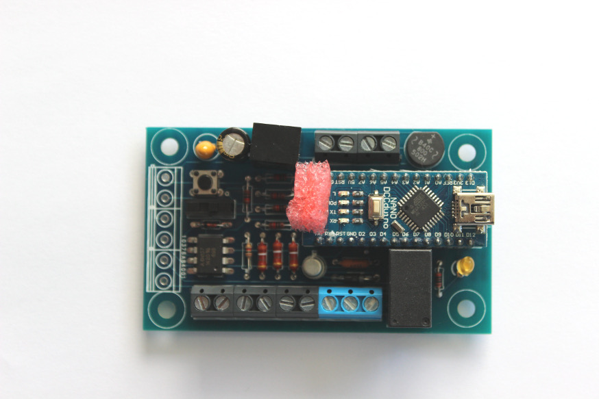

A versatile Arduino stationary dcc decoder
==========================================

When constructing my dcc based train model, I looked for dcc decoder to pilot light (SMD 0402, or standard led), but had difficulty to program them for custom scenario (blinking, road works style, …). There are also some DIY dcc decoder (opendcc decoder) but didn’t manage to make them working. So I decided to create my own stationary dcc decoder based on Arduino, to be able to reprogram it at wish.

This decoder is pretty simple, you can
 * assign it a dcc address (via a learning switch button)
 * connect LED lights, or a relay
 * choose the light mode if you connected lights. There are 3 different modes you can choose via a push button: constant light (on or off), flicker mode, or 3 way road work lights mode

It has been designed to be powered by a 16V AC, but can be as well be powered via DCC signal (15v or 18v), or a DC signal.

Using it
========

Powering
--------
This decoder is designed to be powered by a 16V AC power source. It is possible to power it with the dcc signal, but my circuit is not the most power efficient stationary decoder (due to the fact that it power lights, an arduino and eventually a relay), so you don’t want that, except in rare situation.

This is why there are 2 set of cables:
 * one for the 16V AC
 * one for the DCC signal

Assign a dcc address
--------------------

To assign a dcc address, you have to use the learning switch opposite to the Arduino.
In that position, each time it see a stationary decoder command coming on, it will store it as its new address (and will acknowledge that by blinking the status led).
So to assign a dcc address you just have to
 * push the learning switch opposite to the Arduino.
 * send a command with the wished address
 * you will see the status led blinking, stating that it saw the address and learned it
 * push back the learning switch towards the Arduino

Connect light
-------------

On the bottom of the card, you have 3 slots for leds. The + of the led must be on the left. Normaly you can connect only one led per slot (due to the nominal tension that each led has, 2 different led don't have the exact same nominal tension).

